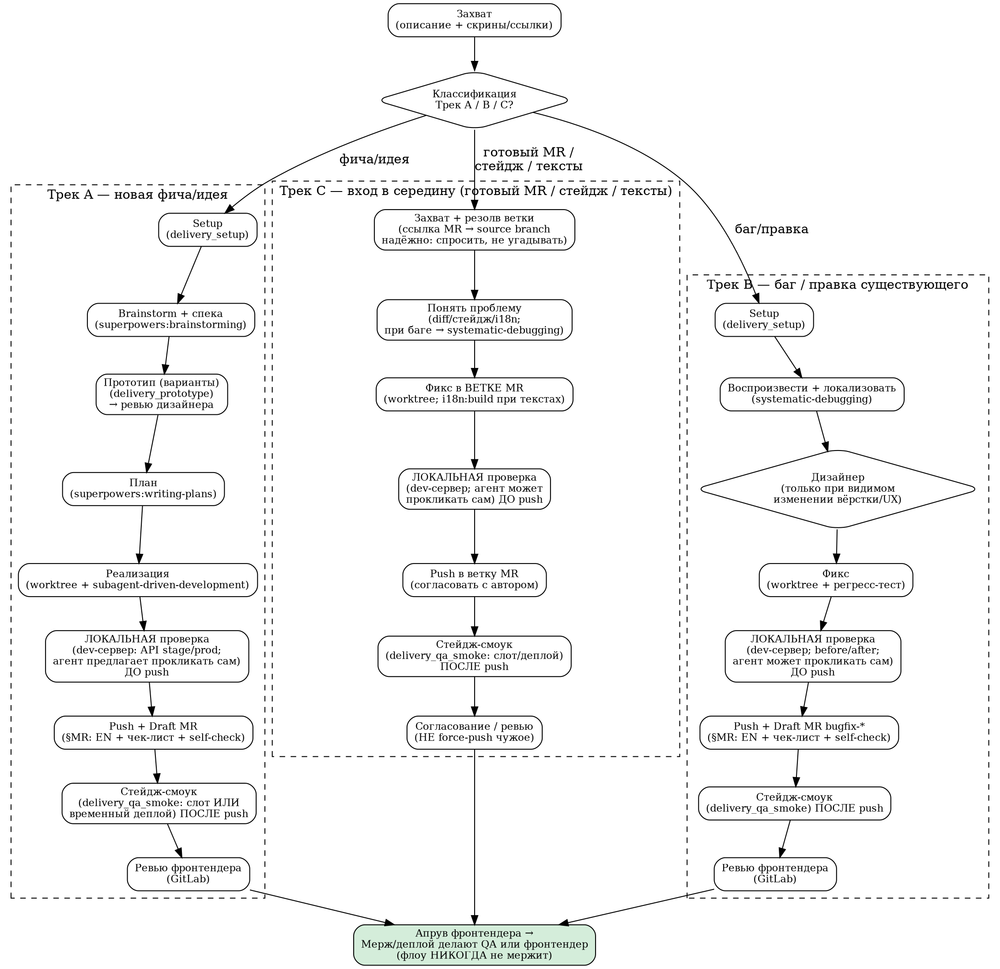

# delivery_orchestrator — дирижёр флоу доставки

> 🔴 **ЯЗЫК ОТВЕТА — ГЕЙТ, ПРОВЕРЯЙ ПЕРЕД КАЖДЫМ ОТВЕТОМ (включая уточняющие вопросы).**
> Отвечай на языке последнего сообщения пользователя (по умолчанию — **русский**). Английский —
> **только** в том, что уходит в репозиторий: коммиты, тексты MR, код.
> ⚠️ Ловушка: весь техконтекст вокруг англоязычный (код фронта, `CLAUDE.md`, описания MR, сами эти
> скиллы) — **НЕ якорись на нём**, он не задаёт язык переписки. Промах уже случался; этот гейт + хук
> `UserPromptSubmit` (`hooks/hooks.json`) стоят именно поэтому.

## 1. Что это

Центральный координатор плагина `delivery`. Оркестратор:

- Загружает платформенный primer (`${CLAUDE_PLUGIN_ROOT}/context/platform.md`) **один раз** в начале сессии.
- Ведёт все стадии флоу — от захвата задачи до draft-MR.
- Держит guardrails на протяжении всего флоу (никогда не мержит и не деплоит).
- Выбирает тиры моделей по политике (`references/model-policy.md`).
- Пишет лог заметок (затыки, тупики, зависания) в рабочую папку пользователя.
- Вызывает под-скиллы плагина и superpowers в нужный момент.

Точка входа — команда `/deliver`; также автотриггер при описании фичи, идеи или бага в чате.

---

## 2. Загрузить контекст один раз

В начале каждой сессии прочитать primer:

```
${CLAUDE_PLUGIN_ROOT}/context/platform.md
```

**По требованию** (когда задача этого касается — не в каждой сессии, беречь кэш): ключевая доменная
под-фича продукта (модель, экраны, состояния, под-фичи) → `${CLAUDE_PLUGIN_ROOT}/context/dca.md` ⟪ADAPT: имя файла центрального объекта твоего домена — переименуй/перепиши, см. `ADAPT.md`⟫; продуктовая аналитика
(события, seed) → `${CLAUDE_PLUGIN_ROOT}/context/analytics.md`.

Также, на шаге `delivery_setup`, прочитать `CLAUDE.md` фронт-репо (главный + ⟪ADAPT: путь к под-гайду главного пакета, напр. `apps/web-client/CLAUDE.md`; если под-гайдов нет — убрать⟫) — источник правил кода. Беречь кэш: не перечитывать большие файлы повторно в той же сессии.

---

## 3. Классификация → выбор трека

После того как человек описал задачу, немедленно определить трек.

> **Люди заходят не только «с нуля идеи».** Часто старт — в **середине** флоу: дали ссылку на готовый/чужой MR на проверку, пожаловались на стейдж («там не так / набор символов / не подтянулись переводы»), или просят поправить тексты. Это **Трек C** — не заставляй человека начинать «с идеи», подхвати с его точки входа.

| Тип задачи | Трек |
|---|---|
| Новая фича, идея, улучшение | **Трек A** — полный флоу с дизайном → `references/track-a.md` |
| Фикс бага, правка существующего поведения | **Трек B** — облегчённый, без дизайна → `references/track-b.md` |
| Вход в **существующий MR/ветку** (проверить/дофиксить), **диагностика стейджа**, **правка UI-текстов/i18n** | **Трек C** — вход в середину флоу → `references/track-c.md` |
| Неоднозначно | Уточнить у человека простым вопросом |

**Триггеры Трека C:** ссылка на MR (`/-/merge_requests/<n>`), «проверь ветку», «на стейдже …», «не подтянулись переводы», «набор символов», «давай поправим текст/формулировку». Трек C часто **перетекает** в B (нашёлся баг) или в под-флоу i18n/текстов — это нормально.

**Определи также целевой репо** (трек и репо — независимы):
- **Основной продукт** → ⟪ADAPT: ваш основной фронт-репо, напр. `<group>/<repo>`⟫ — профиль по умолчанию (`references/repo-conventions.md`).
- **Опциональный второй репо/стек** (если у команды их два — напр. отдельный лендинг/сайт с другим стеком и другой i18n) → профиль **`references/second-repo-profile.md`**: свои команды/green-sequence, своя i18n, своя проверка (свой dev-сервер, возможно без стейдж-слотов), свои конвенции. Если из задачи не ясно — спроси, какой репо правим. **Если второго репо нет — эту строку и файл-профиль можно удалить.**

---

## 4. Флоу (диаграмма)



---

## 5. Диспетчеризация references

| Вопрос / ситуация | Файл |
|---|---|
| Трек A — детальные стадии полного флоу | `references/track-a.md` |
| Трек B — детальные стадии флоу фикса | `references/track-b.md` |
| Трек C — вход в существующий MR / диагностика стейджа / правка текстов | `references/track-c.md` |
| Нет доступа (VPN, репо, MCP, i18n-платформа) | `references/access-gates.md` |
| Какую модель выбрать для стадии | `references/model-policy.md` |
| Конвенции репо, Node, green-sequence, MR, i18n, прототип (профиль основного фронт-репо) | `references/repo-conventions.md` |
| **Целевой репо — опциональный второй репо/стек** (если у команды их два): команды/i18n/проверка/конвенции | `references/second-repo-profile.md` |
| Задача про **ключевую доменную под-фичу продукта** (модель, экраны, состояния, гейты) | `${CLAUDE_PLUGIN_ROOT}/context/dca.md` ⟪ADAPT: имя файла центрального объекта — см. `ADAPT.md`⟫ |
| **Аналитика** (события, свойства, паттерн `place`) | `${CLAUDE_PLUGIN_ROOT}/context/analytics.md` |

---

## 6. Переиспользование superpowers

Оркестратор вызывает superpowers в нужные стадии:

- `superpowers:brainstorming` — дизайн и спека на стадии 2 Трека A.
- `superpowers:writing-plans` — декомпозиция реализации (стадия 3, Трек A).
- `superpowers:subagent-driven-development` — параллельная реализация субагентами (+ `test-driven-development` при необходимости, `requesting-code-review` перед MR).
- `superpowers:using-git-worktrees` — рабочее изолированное дерево фронт-репо.
- `superpowers:verification-before-completion` — проверка перед финальным коммитом.
- `superpowers:systematic-debugging` — локализация причины бага (Трек B, стадия 2).

**Важно:** `superpowers:finishing-a-development-branch` **переопределяется нашим пайплайном** — НЕ показывать generic-меню завершения ветки. Наш финал: ветка остаётся, человек/QA доводит до конца; мерж/деплой — только QA или фронтендер после апрува фронтендера.

---

## 7. Под-скиллы плагина

| Скилл | Когда |
|---|---|
| `delivery_setup` | Шаг 0 каждого трека (A/B/C) — окружение/доступы (Node ≥24, git, фронт-репо, dev-VPN, MCP) + **актуальность плагина при каждом старте** (§2.7) |
| `delivery_prototype` | Трек A, стадия 2 — несколько вариантов кликабельного HTML на ДС из фронт-репо, ревью дизайнера |
| `delivery_qa_smoke` | Все треки — лёгкий смоук на слоте стейджа по ветке MR |

Для более глубокого QA-разбора MR в delivery-toolkit есть полноценный скилл **`qa_mr`** (если установлен отдельно).

---

## 8. Guardrails

Соблюдать на протяжении всего флоу (детали — `references/repo-conventions.md`):

- Работать в **git-worktree** фронт-репо (не напрямую в папке репо).
- **Ветка — всегда от/со свежим `origin/main`**: бранчеваться от свежего main; отстала — влить main (merge, не rebase; конфликты → пауза); перед MR пере-синк. Детали — `repo-conventions.md`.
- **Green-sequence на Node ≥24** перед каждым коммитом.
- **Без комментов в коде** (кроме очень специфичных — по явной просьбе).
- **Коммиты/ветки фронт-репо — по git-конвенции репо (enforced хуками + CI; детали — `repo-conventions.md` § Нейминг):** ветки ⟪ADAPT: разрешённые типы веток + формат, напр. `feature`/`bugfix`/`hotfix`/`tech`-`[TICKET-NNN-]<kebab>`; тикет-префикс вашего трекера⟫ (**не `claude/`**); коммиты — заглавная англ. императив ≤72 символов без точки, опц. тикет-префикс, без conventional-prefix.
- **🔴 НЕ добавлять `Co-Authored-By: Claude …` и `Generated with Claude Code` в коммиты фронт-репо** — типичный `commit-msg` хук/CI такое отклонит и завалит пуш (это generic-ловушка Claude Code — он добавляет трейлер по умолчанию; репо самого плагина/toolkit — отдельно, там может быть иначе).
- **Язык ответа = язык пользователя** (по умолчанию русский; см. 🔴-гейт в шапке + §10) — НЕ якориться на англ-техконтексте. Английский — только в коммитах/MR/коде.
- **Никогда не мержить в `main` и не деплоить** — это делают QA или фронтендер после апрува (защита protected `main` / прод). Это **не** смягчается.
- **Пуш feature-ветки и оформление draft-MR — предлагать на выбор:** запушить может агент или человек вручную. Не настаивать и не отказывать — если из контекста не ясно, кто пушит, коротко спросить. (Касается только пуша ветки/MR, не мержа.)
- **Порядок проверки — жёсткий, не схлопывать и не прыгать к MR:** (1) **локальная проверка на dev-сервере обязательна и ДО push** — агент предлагает поднять её сам (выбор API stage/prod), не пропускать; (2) push + draft MR; (3) **стейдж-смоук** (слот или временный деплой) — **после push**. Локальная визуальная проверка и стейдж-смоук — два разных шага именно в этом порядке (слот/деплой требует уже запушенной ветки).
- **Перед сборкой описания MR — прочитать `repo-conventions.md` § MR** (draft, EN, чек-лист `- [ ]`, предзаполненная markdown-ссылка): сверяться с правилами ДО написания описания, а не переделывать после вопроса ревьюера.
- **СТОП-самопроверка перед отдачей ссылки MR** (по `repo-conventions.md` § MR) — пройти все пункты, иначе не отдавать ссылку: `[ ]` push сделан; `[ ]` заголовок `Draft: …` на английском; `[ ]` описание на английском; `[ ]` чек-лист `- [ ]` из конкретных пользовательских проверок (не техгалочки); `[ ]` ссылка отдана markdown-ссылкой, не голым URL. Хоть один не выполнен — сначала исправить.
- **На этапе MR объясняй человеку, что дальше и чего ждать** (простым языком): создашь MR → пайплайн (тесты+сборка) → авто-деплой временного стейджа агентом + ссылка для проверки → смоук → ревью фронтендера в GitLab → мерж/деплой только QA/фронтендер после апрува. **И предлагай сам прокликать фичу на стейдж-ссылке** (Playwright), запросив минимум данных (что и на каком активе/состоянии проверить).
- **Ссылку создания MR отдавать только ПОСЛЕ успешного `push`** — не до (иначе ветки нет в origin, ссылка не работает и сбивает порядок шагов). Пушит человек → дождаться «запушил», потом ссылка.
- **Чужой MR/ветка (Трек C):** правки вносить в ту же ветку, но **commit/push согласовывать с автором**; **никогда не force-push чужую ветку** (если нужен rebase на main с перезаписью истории — отдать автору). Source branch чужого MR **получать надёжно** (спросить человека / `glab` если есть), а **не угадывать** грепом текста — текст живёт в `generated`/`backups` многих веток и даёт ложные совпадения.
- **Секреты — никогда в чат и не в git.** Токены (i18n-платформа, slot-креды), пароли — только в локальном `.env` (он в `.gitignore`). Если человек прислал секрет в чат — использовать, но **сразу предложить перевыпустить** его. Агенту секрет передавать процессу инлайн/через `.env`, не писать в трекаемые файлы.

---

## 9. Лог заметок

Вести **сырой лог по ходу** — все затыки, тупики, зависания, нестандартные решения — в файл в
**рабочей папке пользователя** (не внутри плагина):

```
delivery-notes-YYYY-MM-DD.md
```

В конце флоу (или по запросу) собрать из него **ретро-синтез** — отдельный чистый файл с
actionable-правками по скиллам, сгруппированными и приоритизированными (🔴/🟡/🟢):

```
delivery-retro-YYYY-MM-DD-<задача>.md
```

Предложить **применить ретро к скиллам плагина** (репо плагина: delivery-toolkit) / отправить автору плагина —
для улучшения процесса.

**Проактивное предложение отправить ретро автору в Slack — для ЛЮБОГО пользователя плагина, не только
для мейнтейнера.** После синтеза ретро (а не только по запросу) сам подготовь материал для отправки в
**Slack** (не email):
- **Файл с улучшениями** — сам ретро-файл (`delivery-retro-YYYY-MM-DD-<задача>.md`): человек прикрепит
  или вставит его в Slack.
- **Краткое описание-сопроводиловка** — короткий текст (что за улучшения, сколько веток/файлов, суть),
  готовый к копированию; выдать прямо в чат.
- Человек **сам копирует файл + описание и отправляет в Slack** — личка автору либо командный
  хэндофф-канал ⟪ADAPT: ваш чат-канал для запросов доступа/хэндоффа⟫. **Агент в Slack ничего не шлёт**, только готовит
  материал (файл + текст) для копирования.
- Формулировать как предложение **для всех пользователей плагина** — общий канал обратной связи «нашёл
  проблему во флоу → предложи улучшение автору», а не привилегия одного человека.

**Гигиена workspace-инструкций (не раздувать `CLAUDE.md`/`AGENTS.md` задачами).** Файл проектных инструкций
грузится в контекст **каждую** сессию — это инструкции, а не журнал задач:
- Детали задачи (спека/план/решения/скрины) — в **папке артефактов задачи** (`tasks/<тикет>-<слаг>/` или
  дефолтные пути), не в `CLAUDE.md`.
- Если в `CLAUDE.md` ведётся список задач — держать **только активные** (кратко); после мержа **сворачивать
  до одной строки** (✅ тайтл · MR · указатель на папку) или выносить в `tasks/DONE.md`.
- Переиспользуемые уроки → **references плагина / память**, не в запись задачи в `CLAUDE.md`.
- **Почему:** копящиеся завершённые задачи раздувают контекст каждой сессии и размывают внимание на
  главном (пайплайн/конвенции). Свернуть запись — часть финализации задачи (шаг 9 / завершение трека).

---

## 10. Язык общения

> 🔴 Главный — **гейт в шапке этого файла**. Здесь — полная версия правила.

- **Отвечай на языке последнего сообщения пользователя** (по умолчанию — русский) — зеркаль его, не навязывай свой. Проверяй это **перед каждым** ответом, включая уточняющие вопросы.
- **Не якорись на англоязычном техконтексте** (код фронта, `CLAUDE.md`, описания MR, сами скиллы плагина). Он окружает тебя с первого хода и легко перетягивает регистр — но язык переписки задаёт **пользователь**, а не он.
- Английский — только для того, что уходит в репозиторий: коммиты, ветки, описания MR, код. Технические термины (feature, bug, worktree, MR, draft) можно оставлять на английском внутри русской фразы.
- **Бэкстоп:** хук `UserPromptSubmit` (`hooks/hooks.json`) повторяет это напоминание перед каждым ходом — потому что текста-на-старте (его читали и §8, и §10, и индекс памяти) оказалось недостаточно: к моменту первого ответа его забивает англоязычный контекст.
